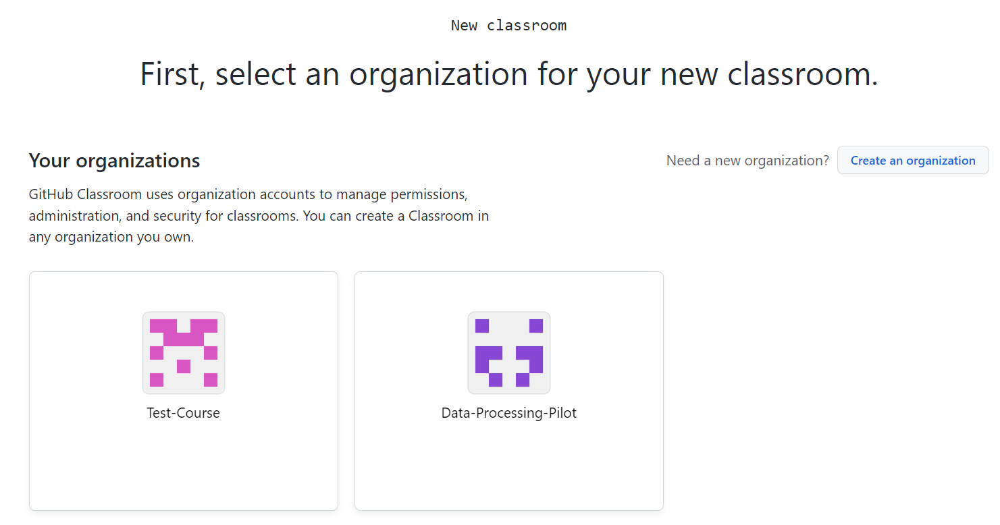
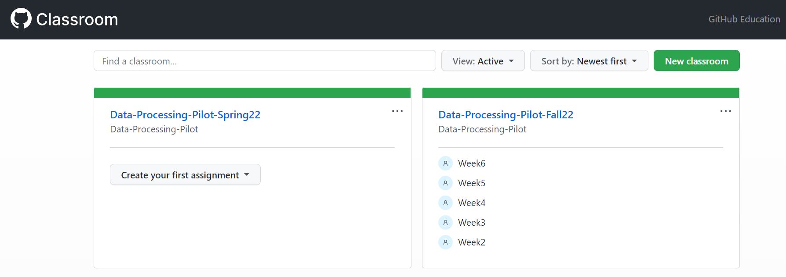

1. Create a GitHub organization for the course
    
   
    <!--  -->
    
2. Set up a GitHub classroom in the course organization for the semester’s class roster
    
    
    
3. Create assignments with the lesson content
4. Use template repositories to reuse a course structure you have created before